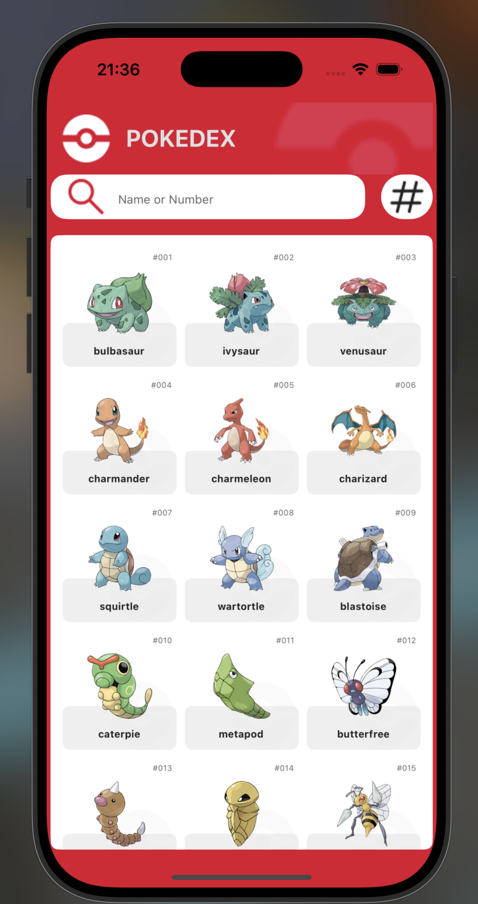
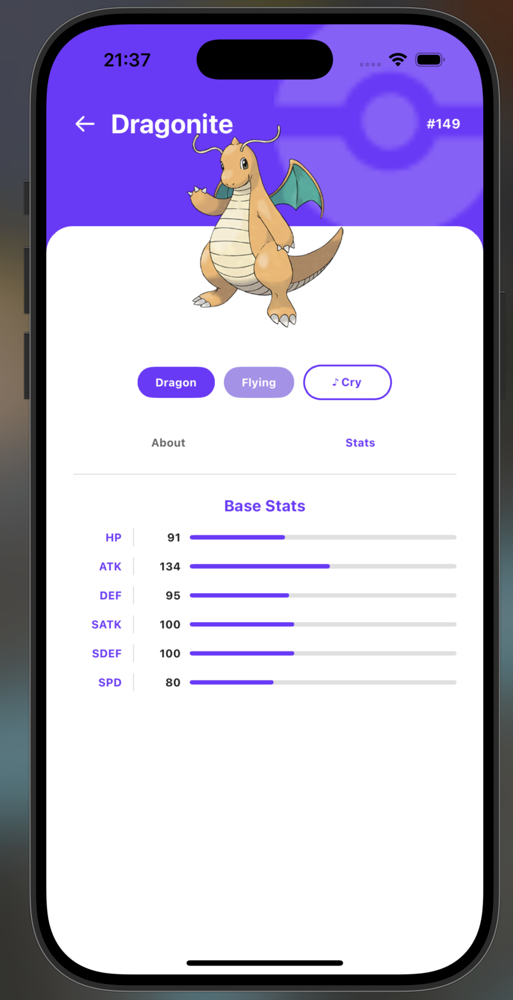
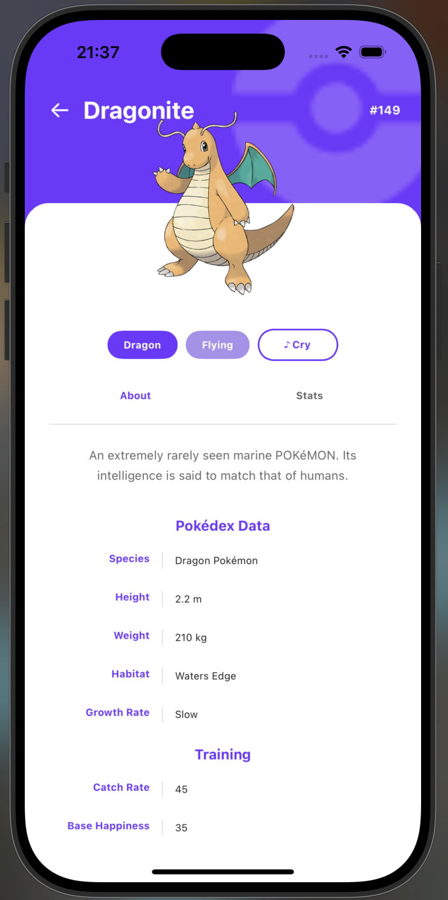

# Pokédex

Application mobile Pokédex construite avec React Native et Expo.

## Screenshots

| Liste | Stats | About |
|-------|-------|-------|
|  |  |  |

## Prérequis

- Node.js 18+
- Expo Go sur iOS ou Android, ou un simulateur/émulateur configuré

## Stack

- **React Native** 0.74 + **Expo** 51
- **TypeScript**
- **expo-router** — routing file-based
- **TanStack React Query** — data fetching & cache
- **expo-av** — lecture audio (cris des Pokémon)
- **PokéAPI** — `https://pokeapi.co/api/v2/`

## Fonctionnalités

- Liste des Pokémon avec infinite scroll (3 colonnes)
- Recherche par nom ou numéro
- Tri par ID ou par nom
- Page de détail avec :
  - Couleur de fond selon le type principal
  - Image officielle du Pokémon
  - Badges de type
  - Bouton pour jouer le cri du Pokémon
  - Onglet **Stats** — barres de statistiques (HP, ATK, DEF, SATK, SDEF, SPD)
  - Onglet **About** — description Pokédex, espèce, taille, poids, habitat, taux de capture, bonheur de base

## Structure

```
app/
├── index.tsx                  # Liste principale
├── about.tsx                  # Page "About" d'un Pokémon
├── pokemon/
│   └── [id].tsx               # Page de détail (stats)
├── components/
│   ├── Card.tsx
│   ├── Radio.tsx
│   ├── Row.tsx
│   ├── SearchBar.tsx
│   ├── SortButton.tsx
│   ├── ThemeText.tsx
│   └── pokemon/
│       ├── PokemonCard.tsx
│       ├── PokemonCryButton.tsx
│       └── PokemonTabs.tsx
├── hooks/
│   ├── useFetchQuery.ts       # usePokemonQuery, usePokemonSpeciesQuery, useInfiniteFetchQuery
│   └── useThemeColors.ts
├── constants/
│   └── Colors.ts              # Couleurs thème + couleurs par type
└── functions/
    └── pokemons.ts
```

## Installation

```bash
npm install
```

## Lancer l'app

```bash
npx expo start
```

Puis ouvrir dans :
- **Expo Go** (iOS / Android)
- Simulateur iOS : `npx expo start --ios`
- Émulateur Android : `npx expo start --android`